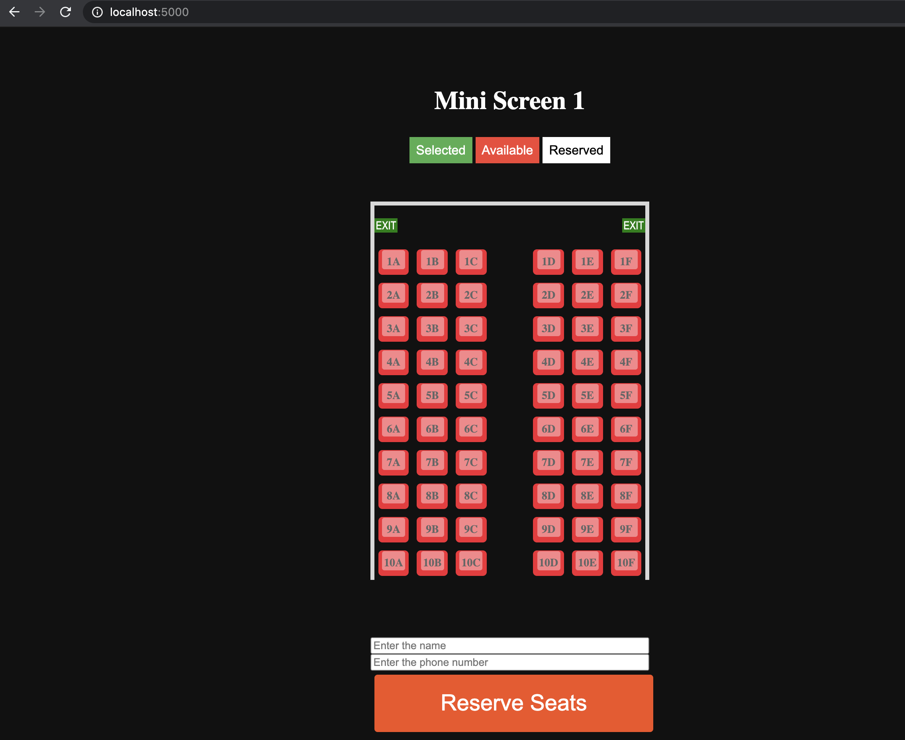
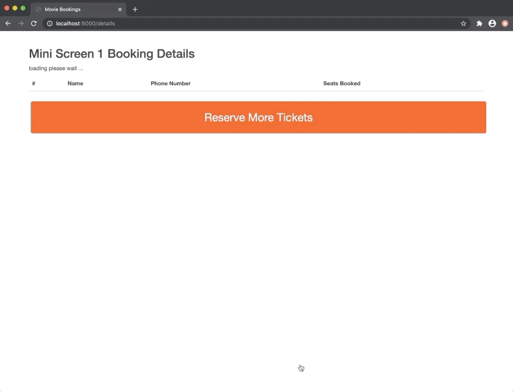
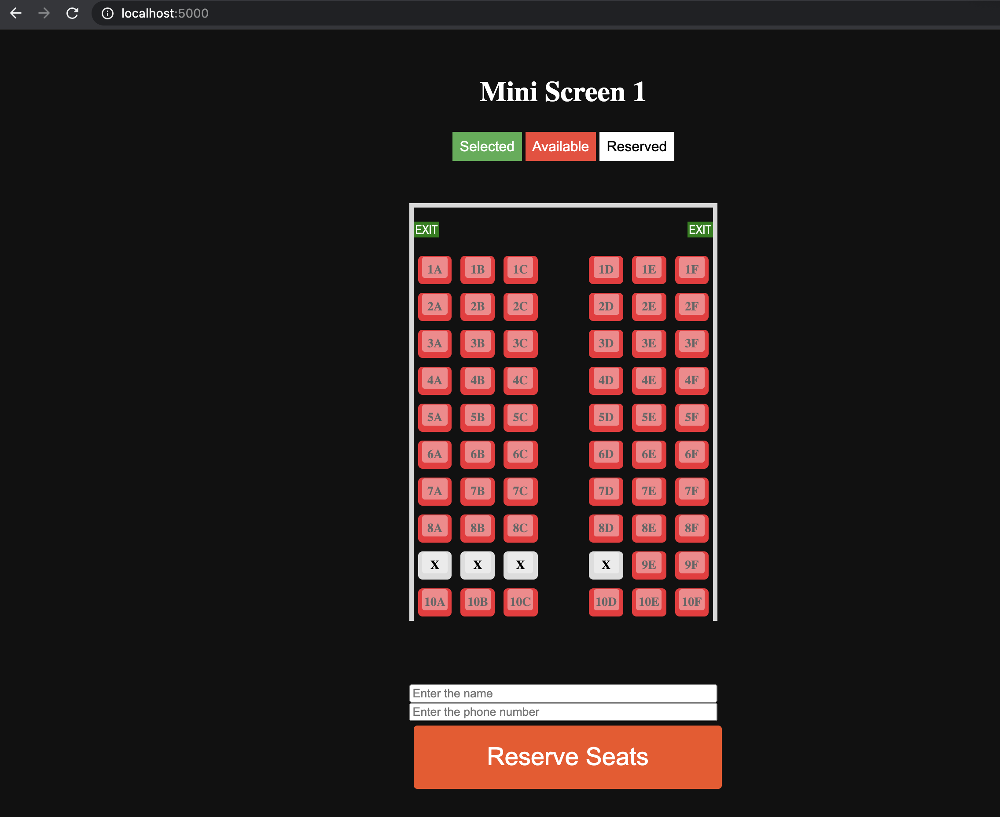

# Build a Movie ticket booking application using Crunchy Data PostgreSQL on Red Hat Marketplace

In this code pattern, you will build a Movie ticket booking application using Crunchy Data PostgreSQL on Red Hat Marketplace.

When the reader has completed this Code Pattern, they will understand how to:

* Deploy CrunchyDB Operator on OpenShift Cluster.
* Create a CrunchyDB cluster and database.
* Access the cluster on your localhost.
* Connect and access CrunchyDB data from a python flask application.   

<!--add an image in this path-->


<!--Optionally, add flow steps based on the architecture diagram-->
## Flow

1. User enters his details and reserves his seat.
2. Application updates Crunchy Data PostgreSQL tables accordingly.
3. Application fetches the updated data from the tables.
4. Application displays the updated seats availability data and booking details data that was feteched from the respective tables. 

## Pre-requisites

1. [Red Hat Marketplace Account](https://marketplace.redhat.com/en-us/registration/om).
2. [IBM Managed Red Hat OpenShift Cluster](https://cloud.ibm.com/kubernetes/catalog/create?platformType=openshift).
3. For all operators being installed from RHM, IBM managed ROKS OpenShift cluster version 4.3 or higher is mandatory. Please set up Classic cluster using the instructions from this URL.
[Setting up OpenShift Cluster](https://cloud.ibm.com/docs/openshift?topic=openshift-getting-started)
4. [OC & kubectl CLI](https://docs.openshift.com/container-platform/3.6/cli_reference/get_started_cli.html).

# Steps

Please follow the below to setup and run this code pattern.

1. [Clone the repo](#1-clone-the-repo)
2. [Install the CrunchyDB Operator from Red Hat Marketplace on OpenShift Cluster](#2-install-the-crunchydb-operator-from-red-hat-marketplace-on-openshift-cluster)
3. [Run the Application](#3-run-the-application)
4. [Analyse the results](#4-analyse-the-results)

### 1. Clone the repo

Clone the `movie_ticket_booking_application_using_crunchydb` repo locally. In a terminal, run:

```
$ git clone https://github.com/IBM/movie_ticket_booking_application_using_crunchydb
```
### 2. Install the CrunchyDB Operator from Red Hat Marketplace on OpenShift Cluster

- Steps to Deploy CrunchyDB Operator from Red Hat Marketplace on a OpenShift Cluster can be found here,
  - [Steps to Deploy CrunchyDB Operator](https://github.com/IBM/rhm-crunchydb-operator-install-steps)

### 3. Run the Application
    
   #### 3.1 Install the dependecies 
   
  - Goto the cloned repo from [step 1](#1-clone-the-repo), in Terminal run the following commands to install the required python libraries and run the app
    - Install Required python libraries, by running the following command:
    ```bash
    $ pip install -r requirements.txt
    ```
    
    - Run the application as follows:
    ```bash
    $ python app.py
    ```
    #### 3.2 Create a table and load it with required data
    
    - Open the following URL in the browser:
    
    `http://localhost:5000/create`
    
    - This will create `screen` and `userdetails` tables in the `Crunchy Data PostgreSQL` database  and load it with required data.
    
   > Note: Please be patient, this step will take a while
    
   #### 3.3 Open the booking application
   
   
   - Click on `here` hyperlink as shown above
   - Alternative you can open `http://localhost:5000/`, to open the application
   - You will now have the booking application on your screen as follows
   
   
   
    
### 4. Analyse the results

   - Type your `name`, `phone number` and `select the seats` as shown in the pictue below,
   
   
   
   - Your booking will be showcased in the booking details tab. Click on `Reserve More Tickets` to reserve more seats.
   
   
   
   - All the reserved seats will be blocked as shown below,
   
   
   
   - You can view the tables in the CruncyDB console, by running the following commands on the terminal,
   
    `kubectl port-forward -n pgo svc/cpdemo-pgadmin 5050:5050`
   
   - Open the browser with the URL, `http://localhost:5050/`. This will open the console for `Crunchy Data PostgreSQL` database.
   
   > For more details on `Crunchy Data PostgreSQL` console, refer to this [tutorial](https://github.com/IBM/perform-crud-operations-using-crunchy-Postgresaql-for-kubernetes-operator-rhm#step-2-perform-crud-operations-on-crunchydb-using-python)
   
   
<!-- keep this -->
## License

This code pattern is licensed under the Apache License, Version 2. Separate third-party code objects invoked within this code pattern are licensed by their respective providers pursuant to their own separate licenses. Contributions are subject to the [Developer Certificate of Origin, Version 1.1](https://developercertificate.org/) and the [Apache License, Version 2](https://www.apache.org/licenses/LICENSE-2.0.txt).

[Apache License FAQ](https://www.apache.org/foundation/license-faq.html#WhatDoesItMEAN)
   
   

